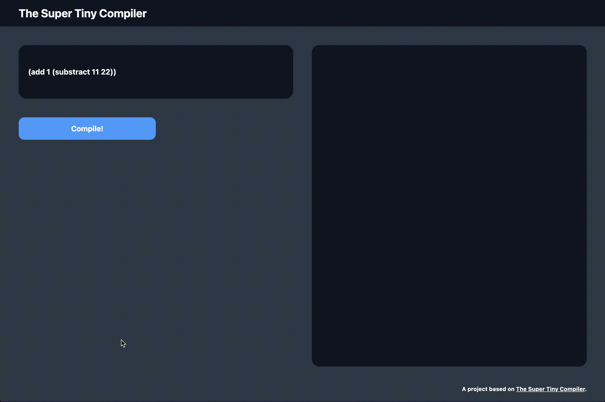

# the-super-tiny-compiler
⚙️ A toy compiler made and served with go

## Reference
[Original Repo Link](https://github.com/hazbo/the-super-tiny-compiler?tab=readme-ov-file) by *Harry Lawrence*.

## Whats a Compiler
A software capable to **translate** from language A to language B.

## What Is Going To Be Done?
A compiler from lisp-like function calls into some C-like function calls.

## The Inner Workings of a Compiler
A compiler has typically has three stages:
1. **Parsing:** Take *raw code* and generate and *abstract representation* of it.
2. **Transformation:** Use the previously generated *abstract representation* and manipulate it somehow.
3. **Code Generation:** Use the *transformed representation* and generate a new code.

## Functionality

